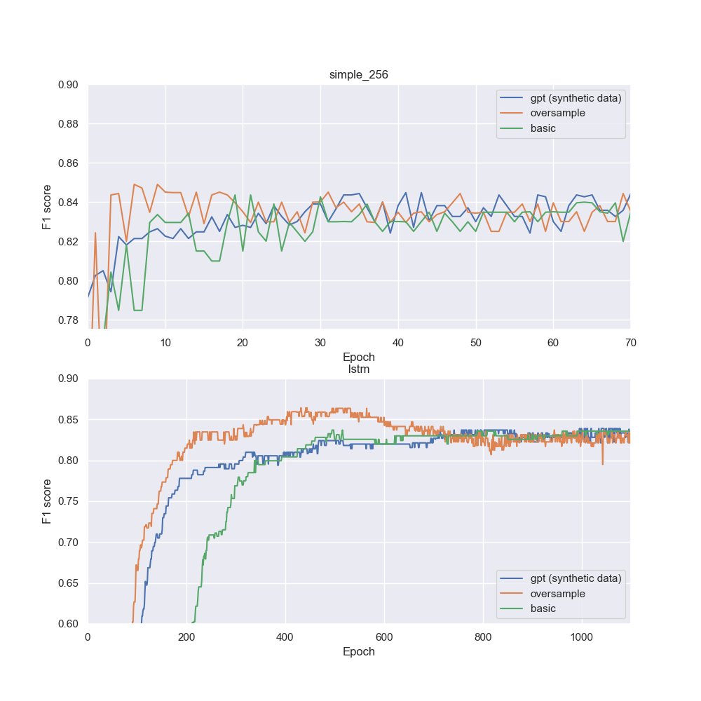

# Hay Paro

## Resumen

Construimos un modelo que recibe el titulo de una noticia de un medio de comunicación, y clasifica si este confirma la existencia de un paro transcurriendo o a futuro. Si bien parece un problema simple, muchos títulos son sumamente confusos hasta para personas:

- "La CGT amenaza con un paro general": Este títlo NO confirma un paro, solo menciona que hay una posibilidad 
- "A pesar de un intento de reconciliación, el paro continua": Este titulo SI confirma un paro
- "Randazzo considera el paro de trenes "totalmente desmedido"": Este titulo es ambiguo, Randazzo habla de un paro transcurriendo? O uno que ya paso? En el primer caso se clasifica como "SI", pero en el otro como "NO".

Esto que introduce un error intrínseco para noticias relacionadas a paros importante.

El modelo consiste en una bi-lstm con los embeddings de Bert, entrenado con aprox. 1400 noticias de distintos medios de comunicación (Clarin, Infobae y La Nacion), y otras 800 sintetizadas por chatgpt.

Para el dataset de test, el modelo resulto en un accuracy de 0.92, un recall de 0.84 y un precision de 0.82.

Los pesos del modelo (para pytorch) pueden encontrarse en https://drive.google.com/drive/u/0/folders/1uGqPRbZPZHtCgQvPiTK2cERTP_gy8vR2

## Datasets

Scrapeamos los medios de La Nación, Clarín e Infobae. Para cada medio obtuvimos 100-400 noticias de secciones de paro de transporte, y aproximadamente 200-1000 noticias no relacionadas de ninguna forma a paros de transporte. Otros medios como el cronista o Ambito tienen títulos mas ambiguous y "clickbait" (eg Hay paro el dia hoy?).

Para las noticias de paro scrapeamos las secciones de "temas de paro de transporte, 
subte, colectivo y tren". Para las de no-paro scrapeamos "economía, política, sociedad, deportes, espectáculos". En ambos casos obteniendo todo lo que ofrecen los medios.

Tomamos la decisión de separar en noticias "relacionadas o no a paros", ya que en muchísimos de casos las noticias que hablan de paros solo mencionan que hay conflicto y que hay un paro posible. Estos títulos son muy similares entre si por lo que esta bueno que el modelo sea competente en discriminar estos casos.

### Noticias recolectadas

Clarin: 391 relacionadas a paro (72% clase positiva), 1055 no-relacionadas.

Infobae: 120 relacionadas a paro (77% clase positiva), 250 no-relacionadas.

La Nacion: 177 relacionados a paro (82% clase positiva), 650 no-relacionados.   

### Separación train-validation-test

Separamos el dataset en un ratio de 60-20-20 para el train-validation-test split. La decision de agrandar tanto los datasets de test y validación fue que al tener tan pocos datos (y tanta experimentación por hacer), realmente amerito sacrificar un poco de data de train para tener una mejor estimación del desempeño del modelo. 

### Balanceo de clases 

Como hay tanta desproporción de clases en el dataset, aplicamos diferentes técnicas y generamos 3 datasets distintos con los que entrenar los modelos.

#### Metodo basico

Para este dataset solo limitamos a las noticias no-relacionadas con paros a no exceder mas del doble de noticias relacionadas a paros.  

#### Oversampling

Sobresampleamos noticias relacionadas a paros para llegar a una proporción:

60% relacionadas a paros, 40% no relacionadas a paros. Con un total de 40% noticias totales que confirman paro y 60% que no.

Se llego a este numero luego de considerable experimentación.

#### Generación datos sinteticos (chatgpt)

Igual al caso anterior, solo que en vez de sobresamplear, generamos datos sintéticos con chatgpt.

Para esto le explicamos al modelo el problema, y le pasamos el dataset de train como csv. Luego le pedimos que genere de a tandas de 50 datos emulando la distribución del dataset y clasificando.

Para asegurarnos que no caiga en repetir 5 títulos con pequeñas variaciones, para cada tanda le pasamos 5 títulos sampleados aleatoriamente y le pedimos que se "inspire en esos" ademas del dataset original.

## Modelo

Para los embeddings usamos un modelo Bert finetuneado llamado Beto https://huggingface.co/dccuchile/bert-base-spanish-wwm-uncased. Su hidden state final se usa como embedding de 768 parámetros. Beto se freezea en todos los casos por falta de datos y poder de computo.

### Experimentación (Train y Validation)

Buscamos elegir el mejor entre los 3 datasets mencionados antes, y entre 2 modelos:

- 2 fc layers de 768 * seq length y 256 parámetros (modelo simple). 
- Bi-LSTM de 768 x, 128 h y c. 

Se entrenaron los modelos con un batch size de 128, un learning rate de 0.001. El modelo de 2 fc layers se entreno 60 epochs, y la bi-lstm 1100:

</img>

El modelo entrenado con el dataset de sobresampleo presenta el mejor rendimiento y parece entrenarse en su punto justo con menos epochs. Sorprendentemente, los modelos entrenados con los datasets de chatgpt y el básico terminan dando aproximadamente igual. Ademas, el performance de la bi-lstm es mas estable y levemente mejor que la del modelo mas simple.

Viendo estos resultados, elegimos como modelo final a una bi-lstm entrenada 600 epochs con el dataset de sobresampleo.

## Resultados

El dataset de testeo tiene casi 500 datos (28% clase positiva), obtuvimos los siguientes resultados (redondeado a dos decimas):

- precision: 0.82
- recall 0.84
- accuracy: 0.92
- accuracy relacionados: 0.75
- accuracy no-relacionados: 0.99

"relacionados" hace referencia a noticias que hacían mención de paros de transporte, pero no necesariamente confirmaban si existía un paro o no.

Observamos que la clase de "no-relacionado" se clasifica de forma casi perfecta, que es razonable ya que hay palabras clave -paro, subte, tren, etc.- que simplemente no aparecen. De forma contraria, el modelo tiene muchos mas problemas clasificando noticias relacionadas a paros de transporte. Esto también es razonable dada la ambigüedad de muchos títulos, por lo que un precision de 0.82 lo consideramos como bastante buen resultado.
